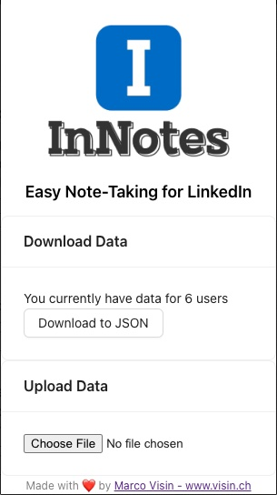
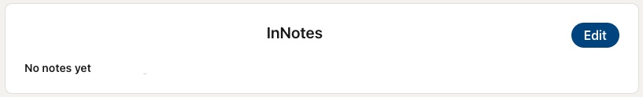

# InNotes
This extension adds a new block into the contact view in any LinkedIn profile, allowing you to take private notes only visible by you.

## Supported platforms
* Google Chrome
* Microsoft Edge
* Safari

## Available Scripts

In the project directory, you can run:

### `yarn build:extension`

This command will build the app as a Chrome extension. You will need to navigate to the `chrome://extensions` tab and click `Load unpacked`. Then, select the build folder.

## Screenshots

